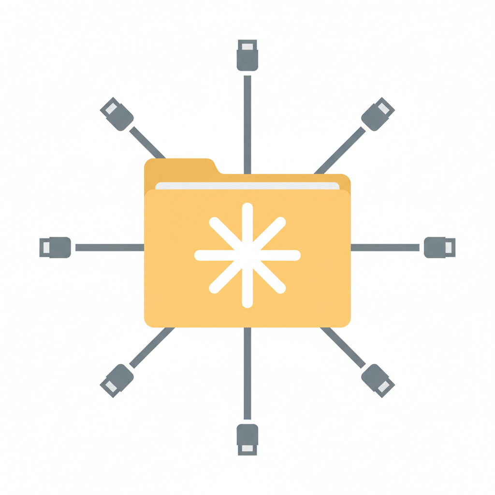

# omniFUSE



Universal virtual filesystem — mount git repos, wikis, and cloud storage as local directories.

Edit files with your favorite editor, and **omniFUSE** syncs changes automatically.

## Installation

### Prerequisites

| Platform | FUSE Driver | Install |
|----------|------------|---------|
| macOS | macFUSE | `brew install macfuse` |
| Linux | libfuse3 | `sudo apt install libfuse3-dev fuse3` |
| Windows | WinFsp | `choco install winfsp` *(planned)* |

### From source

```bash
cargo install --path crates/omnifuse-cli
```

## Usage

### Mount a git repository

```bash
# Remote repo
of mount git https://github.com/user/repo ~/mnt/repo

# Local repo
of mount git /path/to/repo ~/mnt/repo

# Specific branch
of mount git https://github.com/user/repo ~/mnt/repo --branch develop
```

Files you edit in `~/mnt/repo` are auto-committed and pushed.
Remote changes are pulled periodically.

### Mount a wiki

```bash
of mount wiki <BASE_URL> <ROOT_SLUG> <MOUNTPOINT> --auth TOKEN

# Auth token can also be set via environment variable
export OMNIFUSE_WIKI_TOKEN=your-token
of mount wiki <BASE_URL> <ROOT_SLUG> <MOUNTPOINT>
```

Wiki pages appear as `.md` files. Edits are synced back via the wiki API with three-way merge for conflict resolution.

#### Yandex Wiki

For Yandex 360 Wiki use the API host and an [OAuth token](https://yandex.ru/support/wiki/ru/api-ref/access):

```bash
# Yandex 360 (external organizations)
export OMNIFUSE_WIKI_TOKEN=your-oauth-token
of mount wiki https://api.wiki.yandex.net my/project ~/mnt/wiki --org-id YOUR_ORG_ID
```

> **Note:** use the API host (`api.wiki.yandex.net`), not the web UI host.

### Mount S3-compatible storage

OmniFuse mounts any S3-compatible bucket through OpenDAL. Text objects with
non-overlapping local and remote UTF-8 changes are merged automatically; binary
objects report conflicts when both sides change.

```bash
export OMNIFUSE_S3_ACCESS_KEY_ID=your-access-key
export OMNIFUSE_S3_SECRET_ACCESS_KEY=your-secret-key

of mount s3 my-bucket ~/mnt/storage \
  --endpoint https://s3.amazonaws.com \
  --region us-east-1 \
  --prefix project
```

For Cloudflare R2, point at the account endpoint and use `--region auto`:

```bash
of mount s3 my-bucket ~/mnt/r2 \
  --endpoint https://ACCOUNT_ID.r2.cloudflarestorage.com \
  --region auto
```

The backend refuses providers that do not advertise conditional writes
(`write_with_if_match` / `write_with_if_not_exists`) — there is no degraded
unsafe-write mode in V1.

### Other commands

```bash
of check        # Verify FUSE is installed
of gen-config   # Print example TOML config
```

### Desktop GUI

**omniFUSE** includes a Tauri-based GUI with git, wiki, and S3-compatible
backend support, real-time sync logs, and a system folder picker.

```bash
cd crates/omnifuse-gui
cd web && npm install && cd ..
cargo tauri dev
```

---

## Development

See [CONTRIBUTING.md](CONTRIBUTING.md) for architecture, building, testing,
code style, and how to add a new backend.

## License

MIT
